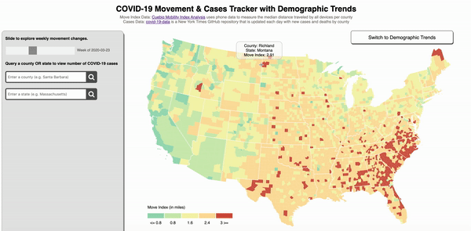
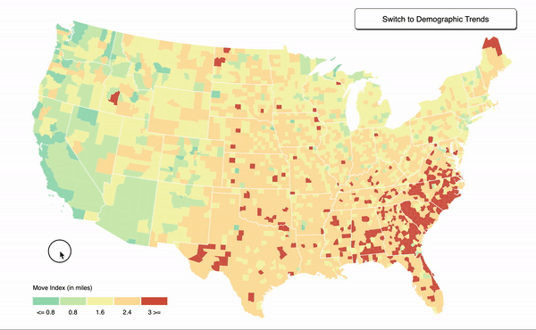
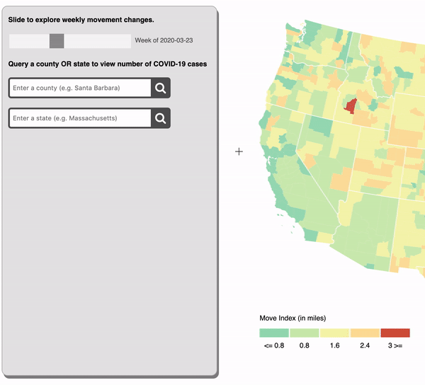
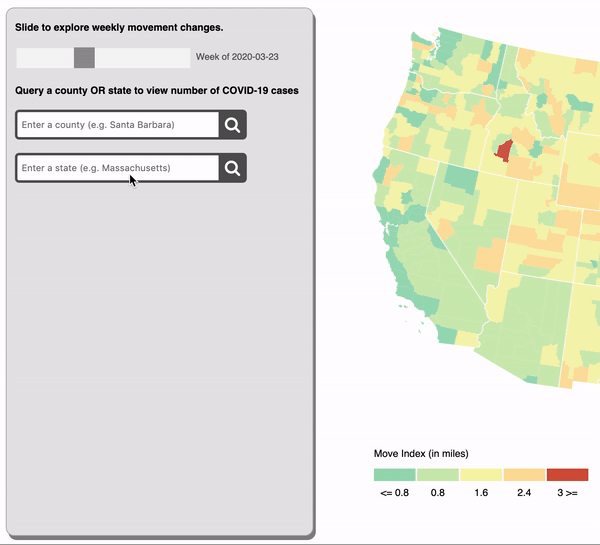
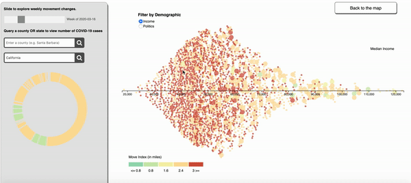

# COVID-19 movement & cases tracker with demographic data

### Data Visualization Final Project
#### Sammy Stolzenbach, Sejal Dua, and Sook-Hee Evans

[Visit our site](https://bit.ly/covidmobility) or [read our Medium article](https://towardsdatascience.com/covid-19-data-visualization-tracking-movement-and-demographic-trends-de8e30aeb140)

#### Data sources: Cuebiq Mobility Insights and New York Times Coronavirus Cases and Deaths in the U.S. GitHub repository

#### Slider
  

#### Tooltip
  

#### Legend
  

#### Bar Chart
  

#### Donut Chart
  

#### Demographic Trends
  
